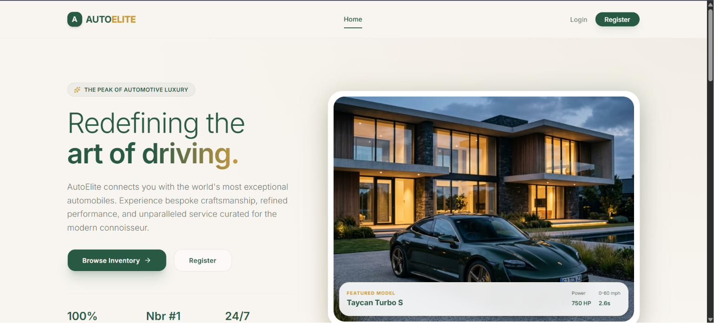
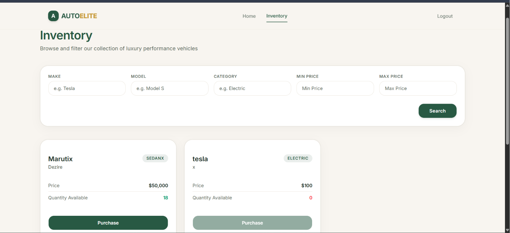
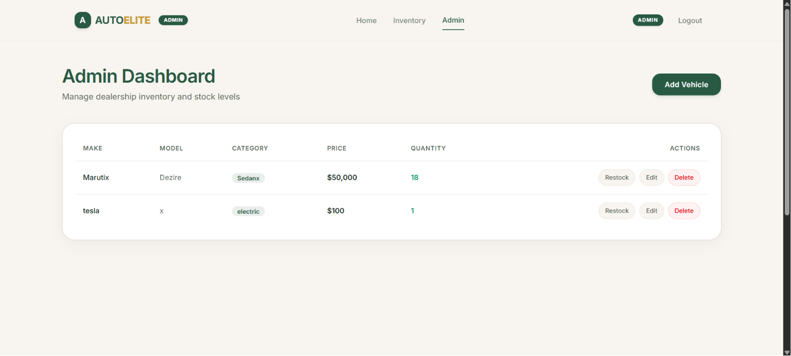
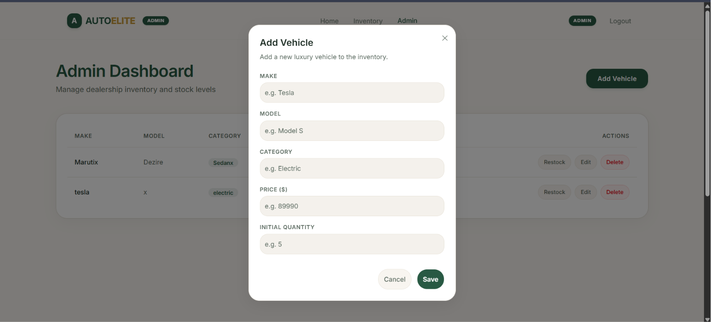
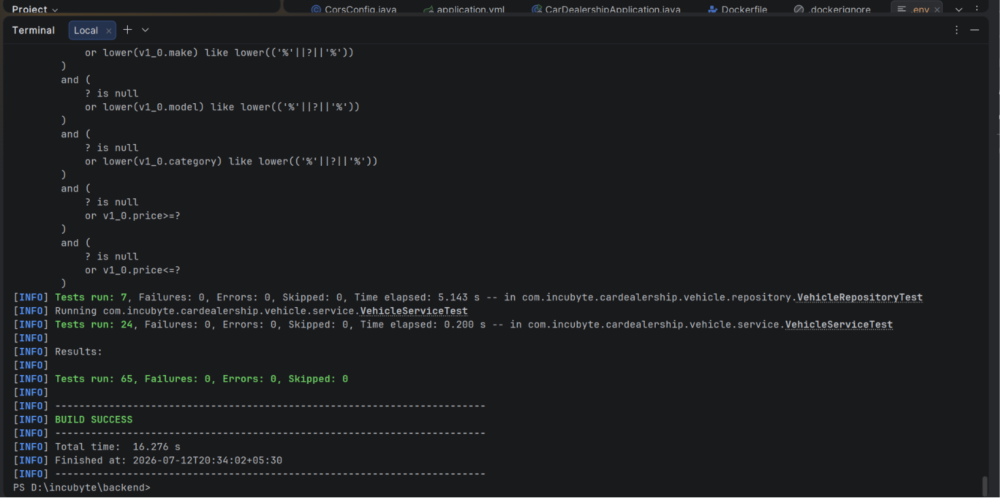
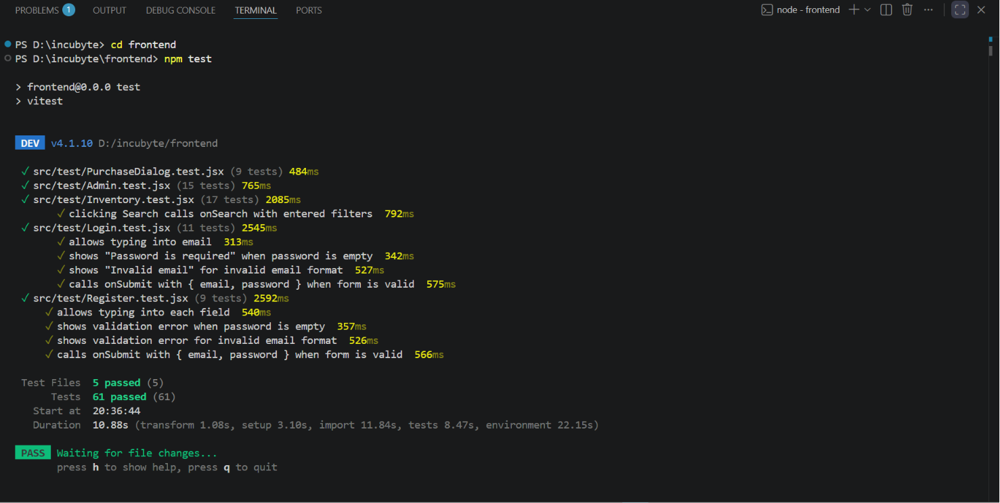

# Car Dealership Inventory System

A full-stack Car Dealership Inventory System built as part of the **Incubyte AI Kata**. The application allows authenticated users to browse and purchase vehicles while providing administrators with a complete inventory management dashboard.

The project follows **Test-Driven Development (TDD)** principles for backend development and component-driven frontend development, emphasizing clean architecture, maintainability, and incremental delivery.

---

## 🔑 Demo Credentials

To test the application, you can use the following default accounts:

*   **Administrator Account:**
    *   **Email:** `admin@dealer.com`
    *   **Password:** `admin123`
*   **Standard Customer Account:**
    *   **Email:** `user@demo.com`
    *   **Password:** `user123`

---

# Features

## Authentication

- User registration
- User login
- JWT-based authentication
- BCrypt password hashing
- Role-based authorization (USER / ADMIN)
- Protected routes
- Persistent login using JWT

---

## Inventory

- View all vehicles
- Search vehicles by:
  - Make
  - Model
  - Category
  - Minimum Price
  - Maximum Price
- Purchase vehicles
- Automatic inventory refresh after purchase

---

## Admin Dashboard

Administrators can:

- Add vehicles
- Update vehicles
- Delete vehicles
- Restock vehicles
- View complete inventory

---

# Tech Stack

## Backend

- Java 21
- Spring Boot
- Spring Security
- Spring Data JPA
- JWT
- SQLite
- Maven
- JUnit 5
- Mockito

## Frontend

- React (JavaScript)
- Vite
- Tailwind CSS v4
- shadcn/ui
- React Router
- Axios
- Sonner
- Lucide React
- Vitest
- React Testing Library

---

# Project Structure

```
.
├── backend
│   ├── src
│   ├── data
│   ├── pom.xml
│   └── Dockerfile
│
└── frontend
    ├── src
    │   ├── components
    │   ├── pages
    │   ├── routes
    │   ├── services
    │   ├── assets
    │   └── test
    │
    ├── package.json
    └── vite.config.js
```

---

# Backend Architecture

```
auth
 ├── controller
 ├── dto
 ├── entity
 ├── repository
 └── service

vehicle
 ├── controller
 ├── dto
 ├── entity
 ├── repository
 └── service

config

security

exception
```

Feature-based packaging was used to improve maintainability and scalability.

---

# REST API

## Authentication

### Register

```
POST /api/auth/register
```

Request

```json
{
  "email": "user@example.com",
  "password": "password123"
}
```

---

### Login

```
POST /api/auth/login
```

Request

```json
{
  "email": "user@example.com",
  "password": "password123"
}
```

Response

```json
{
  "token": "<jwt-token>"
}
```

---

## Vehicles

### Get All Vehicles

```
GET /api/vehicles
```

---

### Search Vehicles

```
GET /api/vehicles/search
```

Supported query parameters

- make
- model
- category
- minPrice
- maxPrice

---

### Purchase Vehicle

```
POST /api/vehicles/{id}/purchase
```

---

## Admin Endpoints

### Add Vehicle

```
POST /api/vehicles
```

---

### Update Vehicle

```
PUT /api/vehicles/{id}
```

---

### Delete Vehicle

```
DELETE /api/vehicles/{id}
```

---

### Restock Vehicle

```
POST /api/vehicles/{id}/restock
```

---

# Security

Authentication is implemented using **JWT**.

Public endpoints:

- POST /api/auth/register
- POST /api/auth/login

Authenticated endpoints:

- View vehicles
- Search vehicles
- Purchase vehicles

Administrator only:

- Add vehicle
- Update vehicle
- Delete vehicle
- Restock vehicle

---

# Database

SQLite is used as the primary database.

Database file:

```
backend/data/dealership.db
```

Reasons:

- Lightweight
- Zero configuration
- Fast local development
- Assignment compliant

---

# Frontend

Pages

- Landing
- Login
- Register
- Inventory
- Admin Dashboard

Features

- Responsive UI
- Role-based navigation
- Protected routes
- Admin route protection
- Purchase confirmation dialog
- Toast notifications
- Loading states
- Error handling

---

# Testing

## Backend

Implemented using:

- JUnit 5
- Mockito

Coverage includes:

- Authentication
- Vehicle CRUD
- Purchase
- Restock
- Search
- Repository queries

---

## Frontend

Implemented using:

- Vitest
- React Testing Library

Coverage includes:

- Register page
- Login page
- Inventory page
- Purchase dialog
- Admin dashboard

---

# Running the Project

## Clone Repository

```bash
git clone <repository-url>
```

---

## Backend

```bash
cd backend
```

Install dependencies

```bash
mvn clean install
```

Run application

```bash
mvn spring-boot:run
```

Runs on

```
http://localhost:8080
```

---

## Frontend

```bash
cd frontend
```

Install dependencies

```bash
npm install
```

Run development server

```bash
npm run dev
```

Runs on

```
http://localhost:5173
```

---

# Running Tests

## Backend

```bash
mvn test
```

---

## Frontend

```bash
npm test
```

or

```bash
npm run test:run
```

---

# Deployment

Backend

- Docker
- Render

Frontend

- Vercel

---

# Screenshots

### 🏠 Landing Page


### 🚗 Inventory Page


### 📊 Admin Dashboard


### ➕ Add Vehicle Dialog


---

# Test Report

## Backend

- Authentication tests
- Vehicle service tests
- Repository tests




Status:

✅ Passing

---

## Frontend

- Register component
- Login component
- Inventory component
- Purchase dialog
- Admin dashboard



Status:

✅ Passing

---

# My AI Usage

This project was developed with AI assistance while ensuring all architectural decisions, implementations, and reviews were manually validated.

### AI Tools Used

- ChatGPT
- Codex
- Antigravity

### How AI Was Used

- Planning project architecture
- Following a moderate Test-Driven Development workflow
- Generating initial unit and component test cases
- Reviewing backend and frontend implementations
- Debugging issues during development
- Suggesting clean code improvements
- Reviewing commit messages
- Assisting with deployment configuration
- Generating documentation

### Workflow

The project followed a pair-programming style workflow:

1. Define feature requirements.
2. Write tests first wherever practical.
3. Implement the minimum code required.
4. Refactor while keeping tests green.
5. Review generated code before committing.

All generated code was reviewed, modified where necessary, and integrated manually.

### Reflection

AI significantly improved development speed by assisting with repetitive tasks, boilerplate generation, debugging, and test creation. However, every architectural decision, code review, and integration was validated manually to ensure correctness and maintainability.

---

# Future Improvements

- Pagination
- Sorting
- Vehicle images
- User purchase history
- Dashboard analytics
- Docker Compose
- CI/CD pipeline
- Refresh tokens
- Email verification

---

